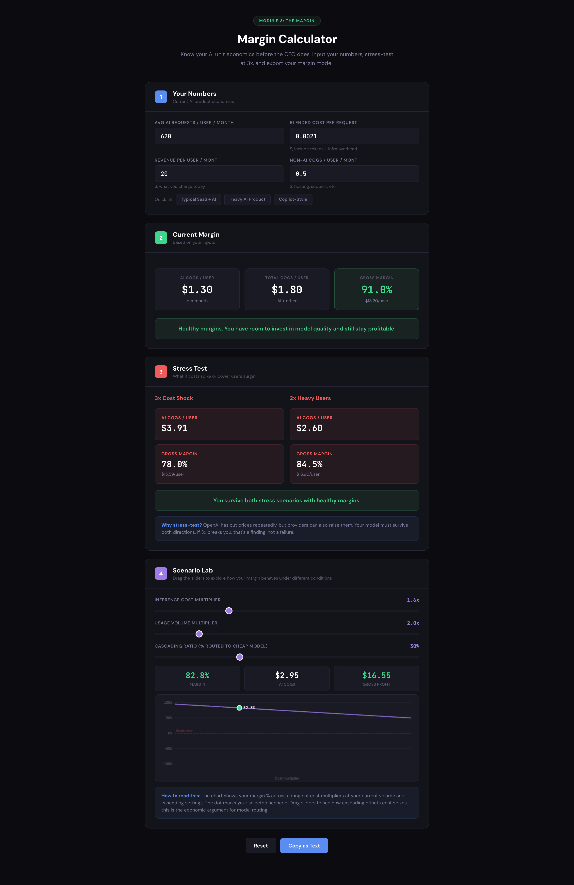
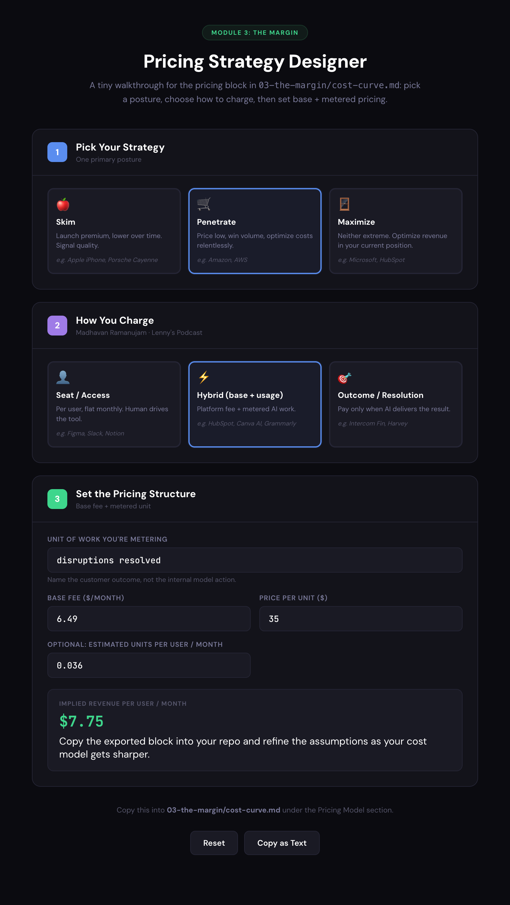

# Cost Curve & Pricing Strategy

**Product:** AI Trip Disruption Copilot — proactively rebooks around flight and hotel disruption instead of leaving the traveller to react.
**Archetype:** Copilot / Orchestrator.
**Unit of analysis:** one **active trip-month** (a user with a live booking). A user with no trip in flight costs nothing; a user mid-trip costs money every fifteen minutes whether they open the app or not.

All figures below are modelled, not disclosed. Confidence ~65%: the model-call side is well bounded, commercial flight-status feed pricing is the soft input.

---

## Packaging Decision

| | Feature | Rationale |
|---|---|---|
| **Leader** | Proactive rebooking with held alternatives — detect, hold the seat/room/transfer, one-tap approve | The only reason anyone changes booking platform. Core, always included. Charging for it kills the wedge. |
| **Filler** | Browse-time disruption risk score + AI search refinement | Lifts conversion and nudges users to pricier nonstop options, so it bumps ARPU. Nobody switches platform for a better search box. Bundled, never sold separately. |
| **Killer** | Full autonomy — auto-rebook inside limits, plus whole-trip re-orchestration (hotel, transfer, reservations) | Where the real cost and the real liability sit, and only a minority will switch it on. |

**Killer usage:** estimated 25–40% enablement. Unmeasured — instrument the autonomy setting after a user's first successful save.
**Bundle or add-on:** **Add-on.** Fails the 70% rule. Priced at $35.00 per disruption resolved — see Pricing Model.

**Why this split matters:** the leader and the margin problem are not the same feature. Detection is cheap and wins the customer; autonomous action is expensive and a minority use it. Bundling them hides the cost of the killer inside a free wedge.

---

## Cost Model

| Cost Category | Per-User/Month | Notes |
|--------------|----------------|-------|
| Inference (primary model) | $0.88 | ~40 frontier calls: search refinement, option ranking, disruption reasoning and re-routing |
| Inference (cascading/triage) | $0.42 | ~580 poll evaluations at ~$0.0007 each — deterministic rules first, cheap model second |
| Infrastructure | $0.18 | Hosting, queueing, notification delivery |
| Data/storage | $0.22 | Flight status, weather and hotel inventory feeds. Scales with usage despite sitting outside AI COGS |
| Human-in-the-loop | $0.10 | Support contact on failed or disputed rebookings |
| **Total AI COGS** | **$1.30** | 620 requests at $0.0021 blended |
| **Total COGS** | **$1.80** | AI + non-AI |

**Revenue per active trip-month:** $20.00 (share of booking commission attributed to the copilot — the base case; the standalone SKU is priced at $7.75 in Pricing Model).
**Gross margin: 91.0% — $18.20 per active trip-month.**

*Margin calculator run, Module 3: 620 requests at $0.0021 blended, $20 revenue, $0.50 non-AI COGS. Confirms 91.0% base margin, 78.0% at 3× cost, 84.5% at 2× usage.*

### Features → tiers → blended COGS

| Feature | Complexity | Model tier | Cost/req | Volume % | Weighted | Rationale (justification for model): why this tier (pros/cons) |
|---|---|---|---|---|---|---|
| Poll evaluation (flight status, hub weather, inventory) | Simple | Small | $0.0007 | 93.5% | $0.00066 | **Pro:** 93.5% of volume — anything dearer here sets the whole curve. **Con:** a missed signal is a customer-facing failure, not a cost overrun. **Why:** pattern-matching against thresholds, no reasoning needed. |
| Search refinement (4 questions, intent parsing) | Medium | Mid | $0.0060 | 3.5% | $0.00021 | **Pro:** needs to read vague input ("somewhere warm") and stay conversational. **Con:** small-tier output reads robotic and users abandon the flow. **Why:** quality is visible to the user, cost is not. |
| Option ranking + "why this trip" copy | Medium | Mid | $0.0120 | 1.6% | $0.00019 | **Pro:** must weigh four stated preferences and justify a ranking in plain English. **Con:** frontier adds polish nobody notices at browse stage. **Why:** cheap enough to ignore, visible enough to matter. |
| Disruption re-route plan + whole-trip re-orchestration | Complex | Frontier | $0.0800 | 1.3% | $0.00104 | **Pro:** this is the leader feature — a wrong rebooking loses a customer permanently. **Con:** 50% of AI COGS on 1.3% of volume. **Why:** the only step with real consequences. Do not economise here. |
| **Blended** | | | | **100%** | **$0.0021** | |

Reconciles to $1.30 AI COGS across 620 requests.

### Correction applied
An earlier run double-counted the polling: the 620 requests already include the ~580 machine polls, and Non-AI COGS carried them a second time at $2.00. Corrected to $0.50, which now covers hosting, support and payment processing only. Cross-check: splitting the other way — 40 AI requests at $0.020 with polls moved into Non-AI COGS at $1.02 — lands at $1.82 against $1.80. The two routes agree.

Keep polls inside the request count rather than in Non-AI COGS, so the usage-volume multiplier scales them correctly. In the split version a storm month reads cheaper than it is.

---

## Cascading Strategy

**Triage model:** deterministic threshold rules first, small/cheap model second. Evaluates flight status, hub weather probability, crew and aircraft rotation, hotel inventory.
**Frontier model:** reserved for reasoning about a live disruption — generating and ranking alternative routings, working out what else in the trip has to move.
**Routing rule:** a poll never reaches the frontier model unless disruption probability crosses ~70% or the itinerary state actually changes.
**Expected cascade ratio:** 94% small / 6% mid+frontier — 580 of 620 requests never touch the frontier model.

**Headroom:** blended cost per request can rise from $0.0021 to **$0.0161 before margin hits 40%** — 7.7×. This is the single assumption to re-test, because it depends entirely on whether a cheap model can be trusted with rebooking reasoning. If it cannot, the escalation rate rises and the headroom is consumed.

### If we cut cost, where and why

- **Cut the poll row, not the frontier row.** Moving 70% of polls to pure rules with no model call at all takes AI COGS from $1.30 to $1.01. It is the only line where volume makes a small saving compound.
- **The saving is trivial, and that is the finding.** Margin moves 91.0% to 92.4%. At $1.80 COGS against ~$200 commission, cost optimisation is not where the value is.
- **So cut for resilience, not margin.** The reason to strip model calls out of polling is the storm month, when the whole affected cohort escalates at once — a load and latency problem before it is a cost one.
- **Never cut the frontier row.** $0.64 per trip buys the one feature people switch platform for. Degrading it to save 3% of COGS risks the 0.9% conversion lift the entire business case rests on.

---

## Pricing Model

**Current pricing:** booking commission, ~10% of trip value (~$200 on a $2,300 booking).
**Proposed AI pricing:** $6.49 per active trip-month base, plus $35.00 per disruption resolved.
**Model:** **hybrid (base + usage), weighted to outcome.**

### Pricing Strategy Block

| | |
|---|---|
| Strategy posture | **Penetrate** |
| Pricing model | **Hybrid (base + usage)** |
| Unit of work metered | **disruptions resolved** |
| Base fee | **$6.49** per active trip-month |
| Price per unit | **$35.00** |
| Estimated units per user/month | **0.036** |
| **Implied revenue per user/month** | **$7.75** |

*Pricing Strategy Designer run, Module 3: Penetrate posture, hybrid base + usage, metered on disruptions resolved. $6.49 base plus $35.00 per resolution at 0.036 units gives $7.75 implied revenue per active trip-month.*

**Decision note.** Travellers will not pay a subscription for a product that visibly does nothing most months, and will not accept a pure per-incident fee that bills them on the worst day of their trip. The base fee prices the watching, which we incur on 100% of trips; the per-resolution fee prices the work, which lands on 3.6%. Penetrate posture because the value only proves itself on trips that break — volume under watch has to come before word of mouth exists. At $6.49 per trip that is 0.3% of a $2,300 booking, an order of magnitude below travel insurance.

**Why 0.036 units:** ~6% of trips need a rebooking, of which ~60% have autonomy enabled and approve.

**Why outcome, not access:** the copilot does the work a human would otherwise do — it finds the seat, holds it, moves the hotel and the transfer. There is a discrete, countable event to bill against, and the value is denominated in money the customer already recognises (a saved day, an avoided $140 airport hotel, a rebooking fee not paid). Access pricing fails on its own terms here: nobody wants unlimited use of a disruption copilot, because heavy usage means a terrible year of travel.

**The economics of the three revenue cases:**

| Case | Revenue / active trip-month | Gross margin | Under 3× cost shock |
|---|---|---|---|
| **Base case** — attached to booking commission | $20.00 | 91.0% | 78.0% |
| **Standalone SKU** — $6.49 base + metered resolutions | $7.75 | 76.8% | 43.1% |
| *Rejected* — resolution fee only, no base | $1.26 | −42.9% | −250% |

**Read the first two rows as alternatives, not as one number.** The $20 driving the cost model is commission attributed to the copilot inside a booking business. The $7.75 is what the copilot charges if sold as its own product. They are different go-to-market choices and should never be added together.

**Cost is incurred on 100% of trips; metered revenue arrives on 3.6% of them.** That asymmetry is why the base fee exists. **Thresholds:** $3.00 per active trip-month clears 40%, and holding 40% under 3× stress needs $7.35 — which the $6.49 base reaches and a $1.99 monitoring fee does not.

**Conclusion:** commission attachment remains the base case. The standalone SKU now survives the stress case at 43.1%, but only because the base fee carries it — the metered line alone never does.

**Commercial risk to name early:** outcome pricing means you earn most when travel goes worst. Selling B2B to an airline or OTA means being paid when their operation fails, which they may reject on optics alone and prefer a flat platform fee. B2C does not have this problem.

---

## Stress Tests

| Scenario | Impact on Margin | Response |
|----------|-----------------|----------|
| Inference costs 3× | AI COGS $3.91, total $4.41 → **78.0%** ($15.59/user) | Hold. 7.7× of headroom on blended cost per request before the 40% bar. No action. |
| Heaviest segment doubles (2× usage) | AI COGS $2.60, total $3.10 → **84.5%** ($16.90/user) | Hold. But "heavy user" is the wrong frame — see storm month below. |
| Model provider raises prices 50% | AI COGS $1.95, total $2.45 → **87.7%** ($17.55/user) | No action. Inference is not the risk in this product. |
| **Storm month: 3× cost and 2× usage together** | AI COGS $7.81, total $8.31 → **58.5%** ($11.69/user) | The realistic bad month. Still clears the bar. This is the number to quote. |

**Why the combined row exists:** disruption is correlated, not independent. A hub closes and every affected trip escalates in the same hour. Peak load is not 3× average, it is the whole affected cohort at once. Running 3× cost and 2× usage as separate scenarios understates the only month that actually matters.

**What the stress test does not cover:** vendors cut LLM list prices over time, but commercial flight-status and inventory feeds have not fallen the same way. Roughly 12% of total COGS sits in a line that does not benefit from the deflation the stress test assumes.

---

## Board One-Pager

The traditional-SaaS side of this comparison is not seat-based — this is a booking business, so the equivalent unit is commission per completed trip.

| | Before, traditional | After, AI-powered |
|---|---|---|
| Revenue | $200.00 per completed trip (~10% commission on a $2,300 booking) | $200.00 + $6.49 base + $35.00 × 0.036 outcomes = **$207.75** |
| COGS | $12.00 fixed — search infrastructure, payments, fraud, support | $13.80 variable — $12.00 fixed + $1.80 AI |
| Gross margin | **94.0%** ($188.00 per trip) | **93.4%** ($193.95 per trip) |

**Net margin shift:** Δ margin **−0.6pp** · Δ gross profit **+$5.95 per trip (+3.2%)**

**Narrative.** Margin percentage falls because we have added a variable-cost line to a business that had almost none, and a board that reads the percentage alone will read it as a step backwards. Gross profit per trip rises $5.95 before any behavioural effect is counted, and the copilot only has to lift conversion or repeat booking by **0.9%** to cover its own COGS — the lowest bar in the model. The hedge worth stating out loud: AI revenue and AI cost both move with disruption, so a bad winter cannot open a gap between them.

### Unit economics of one resolved disruption

| Question | Answer |
|---|---|
| What does one successful outcome cost us? | **$1.50 marginal** — the reasoning burst that finds the routing and re-orchestrates the trip. **$50.00 fully loaded** — $1.80 COGS ÷ 0.036 resolutions per active trip-month. |
| What do we charge for it? | **$35.00 per resolution plus a $6.49 base**, $7.75 per active trip-month. 23× marginal cost, but only 70% of fully loaded. |
| What happens if usage triples? | **Monitoring volume:** COGS $4.41, revenue flat, margin 76.8% → **43.1%**, gross profit $5.95 → $3.34. **Disruption events:** revenue $10.27, COGS ~$3.23, margin **~68.5%**, gross profit up to $7.04. |

**The $48.50 gap between marginal and fully loaded cost is the watching we do on everyone else.** Any unit-cost discussion that quotes only the marginal figure is misleading, and it is the reason the metered fee alone never funds the product.

**We are exposed to the thing nobody worries about and hedged against the thing everyone does.** Tripling monitoring volume halves the margin; tripling disruption events improves it, because outcome pricing couples revenue to the event that drives cost.

---

## Assumptions and Open Questions

1. **$20 attributed revenue is an assumption, not a result.** It is the least examined input in the model and the base case rests on it. The standalone alternative is now priced from the bottom up at $7.75, so the two cases can be compared rather than one being assumed.
2. **The 94% cascade ratio is unvalidated.** It holds only if deterministic rules and a cheap model can carry poll evaluation without missing real disruption. A false negative here is a customer-facing failure, not a cost overrun.
3. **Flight-status feed pricing is the softest number.** It drives the non-AI line and does not deflate with LLM prices.
4. **Autonomy adoption is the metric the business model lives on.** Notify-only users generate no billable outcome. Instrument the setting change after a user's first successful save.
5. **Disruption rate must be modelled as correlated.** Any scenario treating it as independent understates peak cost and peak support load simultaneously.
6. **The flat base fee is regressive against trip value, and probably leaves money on the table.** At $6.49 a $2,500 trip pays 0.26% and an $8,000 trip pays 0.08%, so the fee shrinks exactly as the stakes rise. Travel insurance runs 4–8% of trip cost, which is an order of magnitude of headroom. The candidate fix is to tier the base and hold the metered fee flat — $4.99 under $1,500, $6.49 from $1,500 to $4,000, $12.99 above $4,000, with $35.00 per resolution in every band. **Price the watching by what is at stake; price the work by what it costs to do**, since finding a seat costs the same whatever the trip cost. Untested, confidence ~70%.
7. **There is a regulatory line between a service fee and an insurance product, and the pricing model must stay on one side of it.** Tiering by trip value is fine. Paying out cash on a contingent event is not: reimbursing a loss rather than charging for work performed makes this an insurance product, which brings FCA and IDD scope in the UK and EU, capital requirements and distribution rules. The current structure is a fee for work actually performed and sits outside that. Treat it as a deliberate boundary, and keep marketing copy away from "we'll cover you".
8. **Billing $35 at the moment of disruption charges the customer on the worst day of their trip.** Worth testing a variant where the first resolution is included in the base and only subsequent ones are metered. The revenue difference is small; the goodwill difference may not be.
